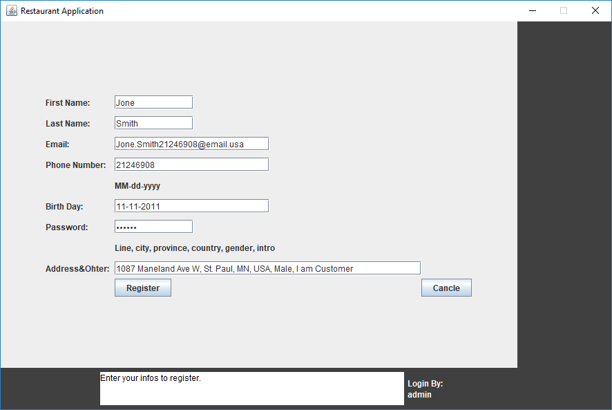

#### Nalongsone Danddank	Student ID :�14958950	StarID: jf3893pd
#### Email: nalongsone.danddank@my.metrostate.edu
#### Metropolitan State University
	
# Restuarant Database Management

	| Java Swing | MySQL | JDBC |
	
	Computer Science major class: ICS 311 — Database Implementation on MySQL by Java and JDBC
         
#### ICS 311 � Database Implementation on MySQL

	Github: https://github.com/ping58972/ICS311_restuarantAPP

	Please follow by below instruction:

# Create local Database:

	In MySQL work bench:

	Create new connection with local database:

	Network address: 127.0.0.1

	User: root
	Password: root

	Then run the my attached "ProjectHandoutStep4_NalongsoneDanddank.sql" script inside folder "database_script" for the new connection to create the database that my app will connect to.

# For Non-IT person OR Non-Programmer:

	Go ahead run or execute "RestaurantAPP.jar" file.

	Register for new user of customer:
	Click on register button to register a new customer member than login with email and password which your set.

## Or login as Customer:
	Email: ping.wang@email.com
	password: 123456

## Input for login as Administration:

	Email: admin@email.com
	password: admin

# For Programmer or IT:

	To run the .java files:

	1.create a new java project with any name

	2.create 4 packet within the new project with the names: "ReaataurantAPP","ReaataurantAPP.database",
		"ReaataurantAPP.database.dao","ReaataurantAPP.GUI".

	3.create 28 new classes within the new project with the names that belong to the packet:
		"ReaataurantAPP"
			"Main.java"
		"ReaataurantAPP.database"
			"Database.java"
			"DatabaseException.java"
		"ReaataurantAPP.database.dao"
			"ConnectionFactory.java"
			"Dao.java" (Interface)
			"Ingredient.java"
			"IngredientDao.java"
			"Item.java"
			"ItemDao.java"
			"ItemUser.java"
			"ItemUserDao.java"
			"Menu.java"
			"MenuDao.java"
			"MenuItem.java"
			"MenuItemDao.java"
			"Order.java"
			"OrderDao.java"
			"OrderItem.java"
			"OrderItemDao.java"
			"Recipe.java"
			"RecipeDao.java"
			"TableQueryDao.java"
			"Transaction.java"
			"TransactionDao.java"
			"User.java"
			"UserDao.java"
		"ReaataurantAPP.GUI"
			"Controller_GUI.java"
			"UserInterface_GUI.java"

	4.copy and paste the contents of each .java files that I submitted into the corresponding class names that you created. 
	For example: copy the code content from my "Database.java" file into your ""Database"  class.

	5.You need to add the jar file to your project Build Path.
		In Eclipse:
		Project->Properties->Java Build Path -> Add External jars 
		Choose the jar file in the folder �libs\mysql-connector-java-8.0.22.jar�

	6.Then right click on "Main.java" in your package "ReaataurantAPP" explorer path > Run as > Java Application.

# Explain:

	In the packet  "ReaataurantAPP.database.dao" files are all relate to database

## For Setup the database 

	Setup user and password and other infos for connection to database: all are belong in the "ConnectionFactory.java" file.  

### Screenshots:

	

