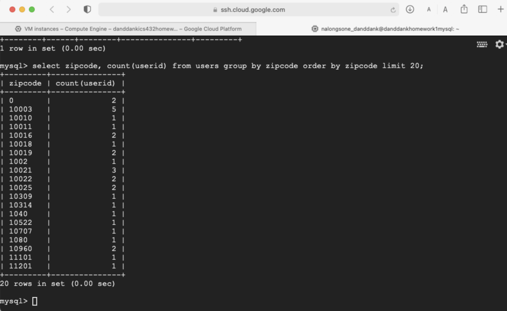
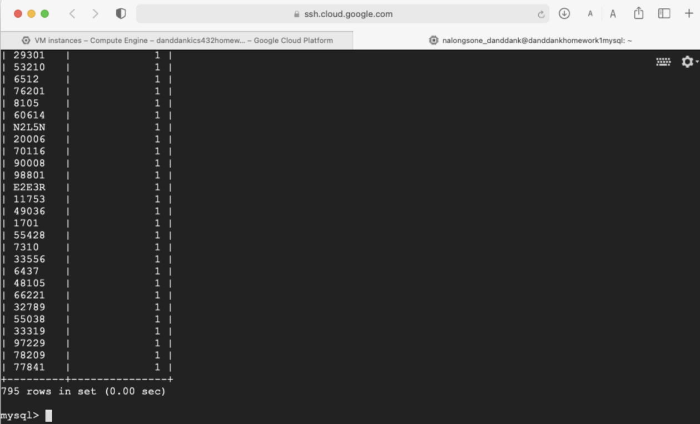

Nalongsone Danddank Student ID : 14958950 StarID: jf3893pd

Email: <nalongsone.danddank@my.metrostate.edu>

**ICS 432 - 01 --- Distributed and Cloud Computing Fall 2021**

**Assignment \#1 :** Working with Cloud Virtual Machines

Exercise 1: Hosting a web site on an AWS EC2 instance.

**Homework report screen-shot \#1:**

{width="5.725in"
height="3.6131944444444444in"}

**Homework report screen-shot \#2:**

{width="5.233333333333333in"
height="4.007638888888889in"}

**Homework report screen-shot \#3:**

{width="5.561111111111111in"
height="5.819444444444445in"}

**Homework report screen-shot \#4:**

{width="5.284722222222222in"
height="1.6833333333333333in"}

**\
**

**Homework report screen-shot \#5:**

{width="4.555555555555555in"
height="4.846527777777778in"}

**Homework report screen-shot \#6:**

{width="5.723611111111111in"
height="4.59375in"}

**Homework report screen-shot \#7:**

{width="5.723611111111111in"
height="4.59375in"}

**Homework report screen-shot \#8:**

{width="5.723611111111111in"
height="4.59375in"}

**\
**

**Homework report screen-shot \#9:**

{width="5.725in"
height="3.6131944444444444in"}

**Homework report screen-shot \#10:**
[**http://18.212.243.94/index.html**](http://18.212.243.94/index.html)

{width="5.725in"
height="3.6131944444444444in"}

**\
**

**Homework report screen-shot \#11:**

{width="5.719444444444444in"
height="4.507638888888889in"}

**Homework report screen-shot \#12:**
[**http://18.212.243.94/danddankindex.html**](http://18.212.243.94/danddankindex.html)

{width="5.725in"
height="1.2715277777777778in"}

**Summarize your learning:**

I have learned to create and launch a EC2 instance of virtual machine in
AWS by web page and terminal command line SSH, and learned how to deploy
a web server to run in AWS in the Linux which I have created, then
install a nginx web server software on the EC2 instance. Then, modified
the security setting of the instance to allow public access for other
people can access the website that I created. Finally, I have to stop
the EC2 instance to terminate the cost for my account bill.

The most important thing is I have familiar with AWS EC2 instance
virtual machine that is every significant concept of current technology
and most popular use to deploy our modern website and other applications
these day.

I think the most challenge me about working with AWS EC2 instance is
working on the stable connection of internet to keep connect from my
computer to a remote machine, AWS. And I have to familiar with the
environment system, Linux, command line and system file of Linux, that
is every challenge for me in the beginning.

Exercise 2: Data Analysis using SQL on a GCP Virtual Machine.

**Homework report screen-shot \#13:**

{width="5.725in"
height="3.6131944444444444in"}

**Homework report screen-shot \#14:**

{width="5.725in"
height="3.6131944444444444in"}

**\
**

**Homework report screen-shot \#15:**

{width="5.725in"
height="3.6131944444444444in"}

**Homework report screen-shot \#16:**

{width="5.725in"
height="3.6131944444444444in"}

**Homework report screen-shot \#17:**

{width="5.725in"
height="2.7930555555555556in"}

**Homework report screen-shot \#18:**

{width="5.725in"
height="2.7930555555555556in"}

**Homework report screen-shot \#19:**

{width="5.725in"
height="2.7930555555555556in"}

**Homework report screen-shot \#20: *943 rows in the users table***

{width="5.725in"
height="2.7930555555555556in"}

{width="5.718055555555556in"
height="5.836805555555555in"}

{width="4.759722222222222in"
height="4.858333333333333in"}

{width="4.759722222222222in"
height="4.858333333333333in"}

{width="4.941666666666666in"
height="5.044444444444444in"}

**Homework report screen-shot \#21: *99548 rows in the rating table***

{width="4.624305555555556in"
height="4.720833333333333in"}

{width="5.301388888888889in"
height="3.120138888888889in"}

**Homework report screen-shot \#22: *1682 rows in the items table***

{width="5.723611111111111in"
height="3.36875in"}

{width="5.434027777777778in"
height="3.198611111111111in"}

**Homework report screen-shot \#23:**

**1-** Find how many ratings are there for each of the following values
(5,4,3,2,and 1). Draw a histogram to show these values

{width="5.723611111111111in"
height="5.4625in"}

  ------------ ----------------------
  **Rating**   **Number of rating**
  **1**        **6102**
  **2**        **11343**
  **3**        **27049**
  **4**        **33972**
  **5**        **21082**
  ------------ ----------------------

**Homework report screen-shot \#24:**

2- Find how many distinct zip codes are there: 795

{width="5.714583333333334in"
height="3.734722222222222in"}

**Homework report screen-shot \#25:**

3- Find how many users are there from each zip code.

{width="5.728472222222222in"
height="3.527083333333333in"}

{width="5.722916666666666in"
height="3.4715277777777778in"}

**Homework report screen-shot \#26:**

4- What is the age and occupation of the user who gave the maximum
number of reviews?

select userid, age, occupation from users where users.userid = (select
userid from ratings group by userid order by count(userid) desc limit
1);

{width="5.209027777777778in"
height="4.595138888888889in"}

**Homework report screen-shot \#27:**

5- What are the top five zip codes in terms of number of users? How many
users are there in each one of these zip codes.

select zipcode, count(zipcode) as num_user from users group by zipcode
order by num_user desc limit 5;

{width="5.704861111111111in"
height="5.032638888888889in"}

**Homework report screen-shot \#28:**

6- Find how many different occupations are there. -\> 21

select count(distinct(occupation)) from users;

{width="4.841666666666667in"
height="4.502083333333333in"}

**Homework report screen-shot \#29:**

7- What are the five top occupations in terms of the number of users?
How many users are there in each one of these top five occupations?

select occupation, count(occupation) as num_user from users group by
occupation order by num_user desc limit 5;

{width="5.039583333333334in"
height="4.686111111111111in"}

**Homework report screen-shot \#30:**

8- What are the top five movie ids in terms of the number of ratings.

**select movieid, count(movieid) as num_rating from ratings group by
movieid order by num_rating desc limit 5;**

{width="4.170138888888889in"
height="3.8777777777777778in"}

**Homework report screen-shot \#31:**

9- Find the top ten movie ids in terms of average rating? What are the
titles for these movies. You can use more than one query.

create view mid_tnr as select movieid, count(movieid) as num_rating from
ratings group by movieid order by movieid;

create view mid_rxn as select movieid, rating, count(movieid) as
num_rating,(rating \* count(movieid)) as rxn from ratings group by
movieid, rating order by movieid;

create view mid_rxn_sum as select movieid, sum(rxn) as sum_rxn from
mid_rxn group by movieid;

create view tnr_join_rxns as select mid_tnr.movieid, sum_rxn, num_rating
from mid_rxn_sum join mid_tnr on mid_rxn_sum.movieid = mid_tnr.movieid;

create view mid_avr as select movieid, sum_rxn, num_rating,
(sum_rxn/num_rating) as average_rating from tnr_join_rxns order by
average_rating desc;

create view mid_avr_title as (select mid_avr.movieid, movietitle,
sum_rxn, num_rating, average_rating from mid_avr join items on
mid_avr.movieid = items.movieid order by average_rating desc, num_rating
desc);

select movieid, movietitle, average_rating from mid_avr_title limit 10;

+\-\-\-\-\-\-\-\--+\-\-\-\-\-\-\-\-\-\-\-\-\-\-\-\-\-\-\-\-\-\-\-\-\-\-\-\-\-\-\-\-\-\-\-\-\-\-\-\-\-\-\-\-\-\-\-\-\-\--+\-\-\-\-\-\-\-\-\-\-\-\-\-\-\--+

\| movieid \| movietitle \| average_rating \|

+\-\-\-\-\-\-\-\--+\-\-\-\-\-\-\-\-\-\-\-\-\-\-\-\-\-\-\-\-\-\-\-\-\-\-\-\-\-\-\-\-\-\-\-\-\-\-\-\-\-\-\-\-\-\-\-\-\-\--+\-\-\-\-\-\-\-\-\-\-\-\-\-\-\--+

\| 1189 \| Prefontaine (1997) \| 5.0000 \|

\| 1293 \| Star Kid (1997) \| 5.0000 \|

\| 1467 \| \"Saint of Fort Washington \| 5.0000 \|

\| 1500 \| Santa with Muscles (1996) \| 5.0000 \|

\| 814 \| \"Great Day in Harlem \| 5.0000 \|

\| 1201 \| Marlene Dietrich: Shadow and Light (1996) \| 5.0000 \|

\| 1653 \| Entertaining Angels: The Dorothy Day Story (1996) \| 5.0000
\|

\| 1599 \| Someone Else\'s America (1995) \| 5.0000 \|

\| 1122 \| They Made Me a Criminal (1939) \| 5.0000 \|

\| 1536 \| Aiqing wansui (1994) \| 5.0000 \|

+\-\-\-\-\-\-\-\--+\-\-\-\-\-\-\-\-\-\-\-\-\-\-\-\-\-\-\-\-\-\-\-\-\-\-\-\-\-\-\-\-\-\-\-\-\-\-\-\-\-\-\-\-\-\-\-\-\-\--+\-\-\-\-\-\-\-\-\-\-\-\-\-\-\--+

{width="5.707638888888889in"
height="4.082638888888889in"}

**Homework report screen-shot \#32:**

{width="6.832638888888889in"
height="4.8875in"}

**\
**

**Homework report screen-shot \#33:**

{width="6.832638888888889in"
height="4.8875in"}

**Summarize your learning:**

I have learned to create and launch a VM instance on GCP by web page and
terminal command line SSH on the web page command line interface, and
learned how to set up My SQL server on the virtual machine of Linux
which I have created, then fill tables with a data set about movie
reviews. After that, write SQL queries to analyze a movie-rating data
set. Finally, I have to stop the VM instance to terminate the cost for
my account bill.

The most important thing is I have familiar with VM instance GCP virtual
machine that is every significant concept of current technology and most
popular use to analyze big data and other like machine learning and data
analyze for data science.

I think the most challenge me about working with GCP's VM instance is
working on the stable connection of internet to keep connect from my
computer to a remote machine on GCP. And I have to write SQL queries
with the environment system, Linux, command line and under system file
of Linux, that is every challenge for me in the beginning.
