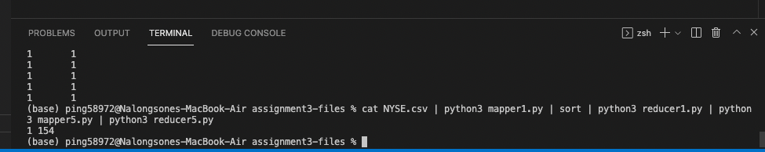

Nalongsone Danddank Student ID : 14958950 StarID: jf3893pd

Email: <nalongsone.danddank@my.metrostate.edu>\\

**ICS 432 - 01 --- Distributed and Cloud Computing Fall 2021**

-   Assignment #1 : Working with Cloud Virtual Machines

-   Assignment #2 : Load Balancing and Auto Scaling

-   Assignment #3 : MapReduce

-   Docker Lab : Docker in AWS and GCP

**Assignment #1 :** Working with Cloud Virtual Machines

Exercise 1: Hosting a web site on an AWS EC2 instance.

**Homework report screen-shot #1:**

{width="5.725in" height="3.6131944444444444in"}

**Homework report screen-shot #2:**

{width="4.519444444444445in"
height="3.4611111111111112in"}

**Homework report screen-shot #3:**

{width="5.561111111111111in"
height="5.819444444444445in"}

**Homework report screen-shot #4:**

{width="5.284722222222222in"
height="1.6833333333333333in"}

**\
**

**Homework report screen-shot #5:**

{width="4.555555555555555in"
height="4.846527777777778in"}

**Homework report screen-shot #6:**

{width="5.723611111111111in" height="4.59375in"}

**Homework report screen-shot #7:**

{width="5.723611111111111in" height="4.59375in"}

**Homework report screen-shot #8:**

{width="5.723611111111111in" height="4.59375in"}

**\
**

**Homework report screen-shot #9:**

{width="5.725in" height="3.6131944444444444in"}

**Homework report screen-shot #10:**
[**http://18.212.243.94/index.html**](http://18.212.243.94/index.html)

{width="5.725in" height="3.6131944444444444in"}

**\
**

**Homework report screen-shot #11:**

{width="5.719444444444444in"
height="4.507638888888889in"}

**Homework report screen-shot #12:**
[**http://18.212.243.94/danddankindex.html**](http://18.212.243.94/danddankindex.html)

{width="5.725in" height="1.2715277777777778in"}

Exercise 2: Data Analysis using SQL on a GCP Virtual Machine.

**Homework report screen-shot #13:**

{width="5.725in" height="3.6131944444444444in"}

**Homework report screen-shot #14:**

{width="5.725in" height="3.6131944444444444in"}

**\
**

**Homework report screen-shot #15:**

{width="5.725in" height="3.6131944444444444in"}

**Homework report screen-shot #16:**

{width="5.725in" height="3.6131944444444444in"}

**Homework report screen-shot #17:**

{width="5.725in" height="2.7930555555555556in"}

**Homework report screen-shot #18:**

{width="5.725in" height="2.7930555555555556in"}

**Homework report screen-shot #19:**

{width="5.725in" height="2.7930555555555556in"}

**Homework report screen-shot #20: *943 rows in the users table***

{width="5.725in" height="2.7930555555555556in"}

{width="5.718055555555556in"
height="5.836805555555555in"}

{width="4.759722222222222in"
height="4.858333333333333in"}

{width="4.759722222222222in"
height="4.858333333333333in"}

{width="4.941666666666666in"
height="5.044444444444444in"}

**Homework report screen-shot #21: *99548 rows in the rating table***

{width="4.624305555555556in"
height="4.720833333333333in"}

{width="5.301388888888889in"
height="3.120138888888889in"}

**Homework report screen-shot #22: *1682 rows in the items table***

{width="5.723611111111111in" height="3.36875in"}

{width="5.434027777777778in"
height="3.198611111111111in"}

**Homework report screen-shot #23:**

**1-** Find how many ratings are there for each of the following values
(5,4,3,2,and 1). Draw a histogram to show these values

{width="5.723611111111111in" height="5.4625in"}

  ----------------------------------- -----------------------------------
  **Rating**                          **Number of rating**

  **1**                               **6102**

  **2**                               **11343**

  **3**                               **27049**

  **4**                               **33972**

  **5**                               **21082**
  ----------------------------------- -----------------------------------

**Homework report screen-shot #24:**

2- Find how many distinct zip codes are there: 795

{width="5.714583333333334in"
height="3.734722222222222in"}

**Homework report screen-shot #25:**

3- Find how many users are there from each zip code.

{width="5.728472222222222in"
height="3.527083333333333in"}

{width="5.722916666666666in"
height="3.4715277777777778in"}

**Homework report screen-shot #26:**

4- What is the age and occupation of the user who gave the maximum
number of reviews?

select userid, age, occupation from users where users.userid = (select
userid from ratings group by userid order by count(userid) desc limit
1);

{width="5.209027777777778in"
height="4.595138888888889in"}

**Homework report screen-shot #27:**

5- What are the top five zip codes in terms of number of users? How many
users are there in each one of these zip codes.

select zipcode, count(zipcode) as num_user from users group by zipcode
order by num_user desc limit 5;

{width="5.704861111111111in"
height="5.032638888888889in"}

**Homework report screen-shot #28:**

6- Find how many different occupations are there. -\> 21

select count(distinct(occupation)) from users;

{width="4.841666666666667in"
height="4.502083333333333in"}

**Homework report screen-shot #29:**

7- What are the five top occupations in terms of the number of users?
How many users are there in each one of these top five occupations?

select occupation, count(occupation) as num_user from users group by
occupation order by num_user desc limit 5;

{width="5.039583333333334in"
height="4.686111111111111in"}

**Homework report screen-shot #30:**

8- What are the top five movie ids in terms of the number of ratings.

**select movieid, count(movieid) as num_rating from ratings group by
movieid order by num_rating desc limit 5;**

{width="4.170138888888889in"
height="3.8777777777777778in"}

**Homework report screen-shot #31:**

9- Find the top ten movie ids in terms of average rating? What are the
titles for these movies. You can use more than one query.

create view mid_tnr as select movieid, count(movieid) as num_rating from
ratings group by movieid order by movieid;

create view mid_rxn as select movieid, rating, count(movieid) as
num_rating,(rating \* count(movieid)) as rxn from ratings group by
movieid, rating order by movieid;

create view mid_rxn_sum as select movieid, sum(rxn) as sum_rxn from
mid_rxn group by movieid;

create view tnr_join_rxns as select mid_tnr.movieid, sum_rxn, num_rating
from mid_rxn_sum join mid_tnr on mid_rxn_sum.movieid = mid_tnr.movieid;

create view mid_avr as select movieid, sum_rxn, num_rating,
(sum_rxn/num_rating) as average_rating from tnr_join_rxns order by
average_rating desc;

create view mid_avr_title as (select mid_avr.movieid, movietitle,
sum_rxn, num_rating, average_rating from mid_avr join items on
mid_avr.movieid = items.movieid order by average_rating desc, num_rating
desc);

select movieid, movietitle, average_rating from mid_avr_title limit 10;

+\-\-\-\-\-\-\-\--+\-\-\-\-\-\-\-\-\-\-\-\-\-\-\-\-\-\-\-\-\-\-\-\-\-\-\-\-\-\-\-\-\-\-\-\-\-\-\-\-\-\-\-\-\-\-\-\-\-\--+\-\-\-\-\-\-\-\-\-\-\-\-\-\-\--+

\| movieid \| movietitle \| average_rating \|

+\-\-\-\-\-\-\-\--+\-\-\-\-\-\-\-\-\-\-\-\-\-\-\-\-\-\-\-\-\-\-\-\-\-\-\-\-\-\-\-\-\-\-\-\-\-\-\-\-\-\-\-\-\-\-\-\-\-\--+\-\-\-\-\-\-\-\-\-\-\-\-\-\-\--+

\| 1189 \| Prefontaine (1997) \| 5.0000 \|

\| 1293 \| Star Kid (1997) \| 5.0000 \|

\| 1467 \| \"Saint of Fort Washington \| 5.0000 \|

\| 1500 \| Santa with Muscles (1996) \| 5.0000 \|

\| 814 \| \"Great Day in Harlem \| 5.0000 \|

\| 1201 \| Marlene Dietrich: Shadow and Light (1996) \| 5.0000 \|

\| 1653 \| Entertaining Angels: The Dorothy Day Story (1996) \| 5.0000
\|

\| 1599 \| Someone Else\'s America (1995) \| 5.0000 \|

\| 1122 \| They Made Me a Criminal (1939) \| 5.0000 \|

\| 1536 \| Aiqing wansui (1994) \| 5.0000 \|

+\-\-\-\-\-\-\-\--+\-\-\-\-\-\-\-\-\-\-\-\-\-\-\-\-\-\-\-\-\-\-\-\-\-\-\-\-\-\-\-\-\-\-\-\-\-\-\-\-\-\-\-\-\-\-\-\-\-\--+\-\-\-\-\-\-\-\-\-\-\-\-\-\-\--+

{width="5.707638888888889in"
height="4.082638888888889in"}

**Homework report screen-shot #32:**

{width="6.832638888888889in" height="4.8875in"}

**\
**

**Homework report screen-shot #33:**

{width="6.832638888888889in" height="4.8875in"}

Assignment #2 : Load Balancing and Auto Scaling

Exercise 1: Implementing a scalable AWS infrastructure to host a web
site.

**Homework report screen-shot #1:**

{width="6.303472222222222in"
height="3.6979166666666665in"}

**Homework report screen-shot #2:**

{width="5.0159722222222225in"
height="4.394444444444445in"}

**Homework report screen-shot #3:**

{width="6.829166666666667in" height="4.00625in"}

**Homework report screen-shot #4:**

{width="6.829166666666667in" height="4.00625in"}

**Homework report screen-shot #5:**

{width="6.829166666666667in" height="4.00625in"}

**Homework report screen-shot #6:**

{width="6.798611111111111in"
height="4.668055555555555in"}

{width="6.798611111111111in"
height="4.668055555555555in"}

**Homework report screen-shot #7:**

{width="6.798611111111111in"
height="4.668055555555555in"}

{width="6.798611111111111in"
height="4.668055555555555in"}

**Homework report screen-shot #8:**

{width="6.798611111111111in"
height="4.668055555555555in"}

**Homework report screen-shot #9:**

{width="6.798611111111111in"
height="4.668055555555555in"}{width="6.798611111111111in"
height="4.668055555555555in"}

**Homework report screen-shot #10:**

{width="6.798611111111111in"
height="4.668055555555555in"}

**Homework report screen-shot #11:**

{width="6.798611111111111in"
height="4.668055555555555in"}

{width="6.798611111111111in"
height="4.668055555555555in"}

{width="6.825694444444444in"
height="4.531944444444444in"}

**Homework report screen-shot #12:**

{width="6.821527777777778in"
height="4.552083333333333in"}

**Homework report screen-shot #13:**

{width="6.825694444444444in"
height="4.5465277777777775in"}

**Homework report screen-shot #14:**

{width="6.817361111111111in" height="3.5375in"}

**Homework report screen-shot #15:**

{width="6.824305555555555in"
height="4.507638888888889in"}

**Homework report screen-shot #16:**

{width="6.829861111111111in" height="4.55625in"}

**Homework report screen-shot #17:**

{width="6.825694444444444in"
height="4.526388888888889in"}

**Homework report screen-shot #18:**

{width="6.819444444444445in"
height="4.420833333333333in"}

**Summarize your learning:**

I have learned to create load balance and auto scale to launch a EC2
instance of virtual machine in AWS, and learned how to deploy a web
server to run in AWS in the Linux instance which I have created by auto
scale group and load balance from AMIs and Instance template. then
install a nginx web server software on the EC2 instance. Then, modified
the security setting of the instance to allow public access for other
people can access the website that I created. Finally, stop all the EC2
instance to terminate.

The most important thing is I know how to create the load balance and
auto scale increase and decrease the number of instances following the
requirement of traffic internet that is every significant concept of
current technology and most popular use to deploy our modern website and
other applications these day.

I think the most challenge me about working with the concept of how to
balance the instances that created by auto scale and how to set up the
parameters for them to let them to be better perform and effective. And
another thing challenge me is working with the environment system,
Linux, command line and system file of Linux, that is every challenge
for me in the beginning to work quickly.

Exercise 2: Implementing a scalable GCP infrastructure to host a web
site.

**Homework report screen-shot #19:**

{width="6.829166666666667in" height="4.00625in"}

{width="6.829166666666667in" height="4.00625in"}

**Homework report screen-shot #20:**

{width="6.829166666666667in" height="4.00625in"}

**Homework report screen-shot #21:**

{width="6.810416666666667in"
height="5.661111111111111in"}

{width="5.670833333333333in"
height="4.713888888888889in"}

**Homework report screen-shot #22:** {width="5.76875in" height="4.795138888888889in"}

{width="6.622222222222222in"
height="5.504861111111111in"}

**Homework report screen-shot #23:**

{width="5.689583333333333in"
height="4.729861111111111in"}

**Homework report screen-shot #24:**

{width="6.721527777777778in" height="5.5875in"}

**Homework report screen-shot #25:**

{width="6.829166666666667in" height="4.00625in"}

**Homework report screen-shot #26:**

{width="6.829166666666667in" height="4.00625in"}

**Homework report screen-shot #27:**

{width="6.810416666666667in"
height="5.661111111111111in"}

**Homework report screen-shot #28:**

{width="6.810416666666667in"
height="5.661111111111111in"}

**Homework report screen-shot #29:**

{width="5.8875in" height="1.5604166666666666in"}

{width="6.823611111111111in"
height="1.0576388888888888in"}

{width="6.745138888888889in"
height="2.265972222222222in"}

**Summarize your learning:**

+-----------------------+-----------------------+-----------------------+
| **Purpose**           | **AWS**               | **GCP**               |
+-----------------------+-----------------------+-----------------------+
| **Running compute     | **Compute -\> Amazon  | **Compute -\> Compute |
| resources on the      | EC2**                 | Engine**              |
| cloud**               |                       |                       |
|                       |                       | **-\> VM instances**  |
+-----------------------+-----------------------+-----------------------+
| **Creating Instance   | **Compute -\> Amazon  | **Compute -\> Compute |
| template**            | EC2 -\> Auto Scaling  | Engine**              |
|                       | -\> Launch            |                       |
|                       | Configurations**      | **-\> Instances       |
|                       |                       | templates**           |
+-----------------------+-----------------------+-----------------------+
| **Create Load         | **Compute -\> Amazon  | **NetWorking -\>      |
| Balancers**           | EC2 -\> Load          | Network services -\>  |
|                       | Balancing -\> Load    | Load Balancing**      |
|                       | Balancers**           |                       |
+-----------------------+-----------------------+-----------------------+
| **Create Security     | **Compute -\> Amazon  | **IAM & Admin -\>**   |
| Groups**              | EC2 -\> Network &     |                       |
|                       | Security -\> Secutity |                       |
|                       | Groups**              |                       |
+-----------------------+-----------------------+-----------------------+
| **Create Instance     | **Compute -\> Amazon  | **Compute -\> Compute |
| Images**              | EC2 -\> Images -\>    | Engine**              |
|                       | AMIs**                |                       |
|                       |                       | **-\>Storage -\>      |
|                       |                       | Images**              |
+-----------------------+-----------------------+-----------------------+
| **Stop compute        | **Compute -\> Amazon  | **Compute -\> Compute |
| resources on the      | EC2**                 | Engine**              |
| cloud**               |                       |                       |
|                       |                       | **-\> VM instances**  |
+-----------------------+-----------------------+-----------------------+
| **Building Monitoring | **Management &        | **Oprations -\>       |
| Application           | Governance -\>        | Monitoring**          |
| Checking**            | CloudWatch**          |                       |
+-----------------------+-----------------------+-----------------------+

**\
**

**Assignment #3 :** MapReduce

Exercise 1: Analyzing Stock Data.

**Task 1.1:**

**1-** Print out some line for looking for some keys, stock_symbol in
the csv file and find out some duplicate of the key that should be the
value. Then, implement python code mapper to print out all of key,
stock_symbol and follow by 1. finally, implement python code for reduce
that combine all value that are same key, and print out the key with
total counting number.

For example: output key and value of reduce, GA 12, GAB 75, GAH 18, GAI
34, GAJ 27\...

2-

{width="4.167361111111111in"
height="2.347916666666667in"}

**3-**

{width="5.697222222222222in" height="3.6625in"}

**4-**

{width="4.728472222222222in"
height="5.102083333333334in"}

**Task 1.2:**

**1-** Print out some line for looking for some keys, stock_symbol in
the csv file and find out some the same key that should be the value.
Then, implement python code mapper to print out all of key, stock_symbol
and follow by its value, stock_price_high. finally, implement python
code for reduce that compare all value that are same key to get the
highest, and print out the key and the highest stock price.

For example: output key and value of reduce, GA 13.35, GAB 11.99, GAH
25.3, GAI 14.62, GAJ 25.79\...

2-

{width="6.742361111111111in"
height="1.9833333333333334in"}

3-

{width="6.781944444444444in"
height="4.397916666666666in"}

4-

{width="4.445833333333334in"
height="5.653472222222222in"}

**Task 1.3:**

**1-** Print out some line for looking for some keys, stock_symbol in
the csv file and find out some the same key and its price and its volume
. Then, implement python code mapper to print out all of key,
stock_symbol and follow by its values, stock_price_high and its volume
greater than 250,000. finally, implement python code for reduce that
compare all value that are same key to get the highest, and print out
the key and the highest stock price and volume>250000.

For example: output key and value of reduce, GA 13.35 299100, GAB 10.6
284400, GAI 4.75 256400, GAP 32.9 371200, GAS 51.54 421800\...

2-

{width="6.8875in" height="2.1180555555555554in"}

3-

{width="6.808333333333334in"
height="3.9930555555555554in"}

4-

{width="6.804166666666666in"
height="7.509722222222222in"}

**Task 1.4:**

**1-** Print out some line for looking for some keys, stock_symbol in
the csv file and find out some the same keys, stock and date, and its
price. Then, implement python code mapper to print out all of keys,
stock_symbol with year which extract by using datetime, and follow by
its values, stock_price_high. finally, implement python code for reduce
that compare all price that are same keys, stock and year to get the
highest price, and print out each stock and each year with the highest
stock price.

For example: output key and value of reduce, GYC 2019 18.15, GYC 2018
20.6, GYB 2020 21.41, GY 2019 8.43, GY 2018 8.64\...

2-

{width="6.815277777777778in"
height="2.048611111111111in"}

3-

{width="6.795138888888889in"
height="3.829861111111111in"}

4-

{width="6.5569444444444445in"
height="7.272222222222222in"}

**Task 1.5:**

**1-** First do the Job 1 by run the CSV file with mapper1.py and
reducer1.py, then go to do Job 2 by taking the output to run the
mapper5.py and reducer5.py which implement to count all number that
output from Job 1 to find total number distinct stock symbols.

Output: 1 154

2-

mapper1.py

{width="5.425694444444445in"
height="1.3291666666666666in"}

mapper5.py

{width="4.870138888888889in"
height="1.1930555555555555in"}

3-

reducer1.py

{width="4.870138888888889in"
height="2.453472222222222in"}

reducer5.py

{width="4.870138888888889in"
height="1.6930555555555555in"}

4-

{width="5.0784722222222225in"
height="1.0104166666666667in"}

Exercise 2: Implementing Relational Union and Intersection using
mapreduce.

**Task 2.1:**

**1-** Print out some line for looking for some product ID in both the
txt file and find out some duplicate of the ID. Then, implement python
code mapper to print out and sort all of both file each line. finally,
implement python code for reduce ignore the same product ID, and print
out the unique product ID line with their describe and price.

For example output:

1001 Zip Bag 100

1002 Harness 150

1003 Full Charger 125

1004 Big Helmet 40

1009 Small Helmet 40

2001 Stove 80

2002 Soft Boot 70

2003 Soft-L Jacket 35

2004 Strongster Harness 20

2008 Boot 70

2009 Umbrella 70

3001 Pad 25

3002 Knife 60

3003 Soft Sock 15

3004 Big Tire 30

3008 Small Tire 30

4004 Hard Boot 90

4009 Stand 90

5005 Tent 150

6006 Hi-Tent 250

7007 Tech GPS 300

8008 Pedals 20

9009 Reli-Rope 302-

{width="5.874305555555556in"
height="1.9666666666666666in"}

3-

{width="5.447916666666667in" height="2.7875in"}

4-

{width="5.331944444444445in"
height="4.629166666666666in"}

**Task 2.2:**

**1-** Print out some line for looking for some product ID in both the
txt file and find out some duplicate of the ID. Then, implement python
code mapper to print out and sort all of both file each line. finally,
implement python code for reduce ignore the product ID which only belong
in just one file, and print out the unique product ID which belong to
both files with their describe and price.

For example output:

1001 Zip Bag 100

1002 Harness 150

1003 Full Charger 125

1004 Big Helmet 40

2001 Stove 80

2002 Soft Boot 70

2008 Boot 70

3001 Pad 25

3002 Knife 60

3003 Soft Sock 15

4004 Hard Boot 90

6006 Hi-Tent 250

2-

{width="6.514583333333333in"
height="2.1527777777777777in"}

3-

{width="6.476388888888889in"
height="3.0840277777777776in"}

4-

{width="6.605555555555555in"
height="2.3715277777777777in"}

**\
**

**Docker Lab :** Docker in AWS and GCP

Exercise 1: Docker in AWS with Python Flask

**Lab report screen-shot #1:**

{width="6.488888888888889in"
height="4.23125in"}

{width="6.488888888888889in"
height="4.23125in"}

{width="6.488888888888889in"
height="2.4180555555555556in"}

{width="6.618055555555555in"
height="1.0993055555555555in"}

{width="6.659027777777778in"
height="1.2215277777777778in"}

**Exercise 2:** Docker in GCP with Python Flask

**Lab report screen-shot:**

{width="6.488888888888889in"
height="4.23125in"}

{width="6.293055555555555in"
height="4.103472222222222in"}

{width="6.488888888888889in"
height="4.23125in"}

{width="6.159722222222222in"
height="0.8805555555555555in"}

{width="6.004166666666666in"
height="0.9270833333333334in"}
