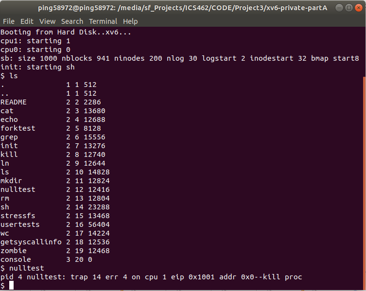
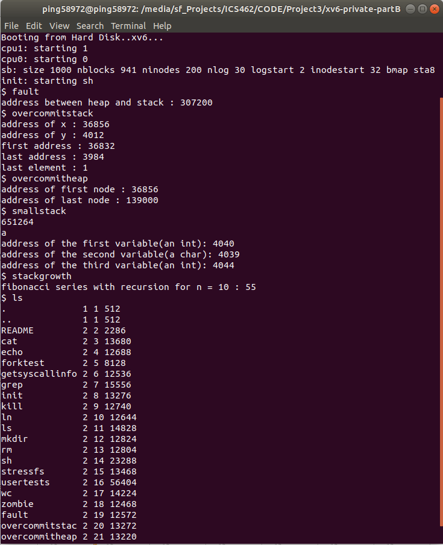

Author: Nalongsone Danddank	

Student ID : 14958950	
StarID: jf3893pd

Email: nalongsone.danddank@my.metrostate.edu

Metropolitan State University, St. Paul

Department of Information and Computer Science

ICS 462 Operating Systems
Spring 2021

# Project 3: The Null Pointer and Other Tricks

    Developing Environment:
        CPU: intel X86
        OS: window 10 (64bit)
        Virtual OS: VM Box 6.1.2
            Ubunto 18.04.5 LTS (64 bit)
                GCC :(Ubuntu 7.5.0-3ubuntu1~18.04) 7.5.0
                GNU gdb (Ubuntu 8.1.1-0ubuntu1) 8.1.1
                qemu-x86_64 Version 4.1.0

    Original source from:
        Github clone: https://github.com/mit-pdos/xv6-public.git

    Following the project assignment 3 requirment, 
        and due to my implentation of the part B caused conflicts with Part A, 
        so I saparated xv6 folders to two part, 
        but the README file of two part is in the same and all in here: 

    Part A: Null-pointer Dereference.   
        1. mmu.h (check memory layout page size):
            -> #define PGSIZE 4096    on line  85
        2. Makefile
            -> add "_nulltest\" to UPROGS and "nulltest.c" to EXTRA, to test the null pointer refenrece.
            -> Modefy on line 149: $(LD) $(LDFLAGS) -N -e main -Ttext 0x1000 -o $@ $^
            -> Modefy on line 156: $(LD) $(LDFLAGS) -N -e main -Ttext 0x1000 -o _forktest forktest.o ulib.o usys.o
        3. exec.c
            -> when Load program into memory. we change sz = 0 to page size value, PGSIZE; on line 44
        4. vm.c
            -> Change the function copyuvm by creates a copy of the parent for a child process:
                at line 326: from "for(i = 0; i < sz; i += PGSIZE){" to "for(i = PGSIZE; i < sz; i += PGSIZE){"
        5. add nulltest.c file to the folder and create nulltest systemcall to test:
            #include "types.h"
            #include "user.h"
            int main(int argc, char *argv[]){
                int *p = 0;
                printf(1, "Testing Null pointer refenrece: %d\n", *p);
                exit();
            }
        To run the OS in xv6-private-partA folder: (see partA_result.png)
            -> cd enter in the folder xv6-private-partA.
            -> type input command line "make qemu-nox" 
            -> then we get in the OS.
            -> type commandline "nulltest" which we created 
                instead of the memory address of *p = 0 result, 
                we get result that throw error exception when a null pointer is dereference like below:
                    "pid 4 nulltest: trap 14 err 4 on cpu 1 eip 0x1001 addr 0x0--kill proc"

Show Result:

    Part B: Stack Rearrangement 
        1. memlayout.h
            -> at line 4 add: #define USERTOP 0xA0000  //the high end of user address space 640 KB
        2. syscall.c
            -> Make sure that the current process's address stay withint the USERTOP threshold by 
                replacing every instance of "curproce->sz" with USERTOP or KERNBASE.
            -> at line 22: "if(addr >= curproc->sz || addr+4 > curproc->sz)" -> "if(addr >= USERTOP || addr+4 >= USERTOP)"
            -> at line 38: "if(addr >= curproc->sz)" -> "if(addr >= USERTOP)"
            -> at line 42: "ep = (char*)curproc->sz;" -> "ep = (char*)USERTOP;"
            -> at line 69: "if(size < 0 || (uint)i >= curproc->sz || (uint)i+size > curproc->sz)" ->
                "if(size < 0 || (uint)i >= KERNBASE || (uint)i+size > KERNBASE)"
        3. proc.h
            -> add "unit stackTop" to "struct proc" at line 52.
        4. exec.c
            -> add new variable, "unit stackTop" to use internally. at line 70 - 74.
            -> Allocate an inacessible page and a second page for the user stack.
                stackTop = USERTOP - (2 * PGSIZE); 
                if((sp = allocuvm(pgdir, stackTop, USERTOP)) == 0){
                    goto bad;
                }
            -> then set the process's "stackTop to the internal stackTop.
                at line 110: myproc()->stackTop = stackTop; 
        5. proc.c
            -> set the initial of process stackTop to 0 in the userinit function.
                at line 145: p->stackTop = 0;
            -> then modify the process state from "p" into the new process with 
                the new myproc()-> stackTop at line 198:
                from "if((np->pgdir = copyuvm(curproc->pgdir, curproc->sz)) == 0){" ->
                    "if((np->pgdir = copyuvm(curproc->pgdir, curproc->sz, curproc->stackTop)) == 0){"
            -> at line 208:   np->stackTop = curproc->stackTop;
        6. trap.c
            -> add a case for pagge faults when the OS kills a process.
                case T_PGFLT: 
                    ...//// CODE ////...
                    break;
        7. vm.c
            -> add line 425 - 444: add growstack function to grow the stack based on wheter momory 
                is already present or new memory needs to be allocate.
                int growstack(pde_t *pgdir, uint sp, uint stackTop){
                    ...//// CODE ////...
                }
            -> add a helper function "setpteu" to set PTE_U.
                void setpteu(pde_t *pgdir, char *uva){
                    ...//// CODE ////...
                }
            -> then modify "copyuvm" to take in a third parameter, 
                "stack_top" and use it to copy memory within the function for when there's a process.
                if(stack_top == 0) return d;
                for(i = stack_top; i < USERTOP; i += PGSIZE){
                    ...//// CODE ////...
                }
                return d;
        8. defs
            -> Modify at line 184: "pde_t* copyuvm(pde_t*, uint);" -> "pde_t* copyuvm(pde_t*, uint, uint);" 
            -> add a new one at line 189: void  setpteu(pde_t *pgdir, char *uva);
            -> add a new one at line 190: int   growstack(pde_t*, uint, uint);
        9. Adding new six C files to the xv6-private-partB folder:
            -> badaddress.c to test bad address.
            -> fault.c to test fault adress.
            -> overcommitheap.c to test over commit heap. 
            -> overcommitstack.c to test over commit stack.
            -> smallstack.c to test small stack.
            -> stackgrowth.c to test stack growth by fibonacci series with recursion.
        10. Makefile
            -> in UPROGS=\ 
                add: _fault\ _overcommitstack\ _overcommitheap\ _smallstack\ _stackgrowth\ _badaddress\
            -> in EXTRA=\  
                add: badaddress.c fault.c overcommitheap.c overcommitstack.c smallstack.c stackgrowth.c

        To run the OS in xv6-private-partB folder: (see partB_result.png)
            -> cd enter in the folder xv6-private-partB.
            -> type input command line "make qemu-nox" 
            -> then we get in the OS.
            -> type commandline which we created and we get the result like below:
                $ fault
                address between heap and stack : 307200

                $ overcommitstack
                address of x : 36856
                address of y : 4012
                first address : 36832
                last address : 3984
                last element : 1

                $ overcommitheap
                address of first node : 36856
                address of last node : 139000

                $ smallstack
                651264
                a
                address of the first variable(an int): 4040
                address of the second variable(a char): 4039
                address of the third variable(an int): 4044

                $ stackgrowth
                fibonacci series with recursion for n = 10 : 55

Show Result:

